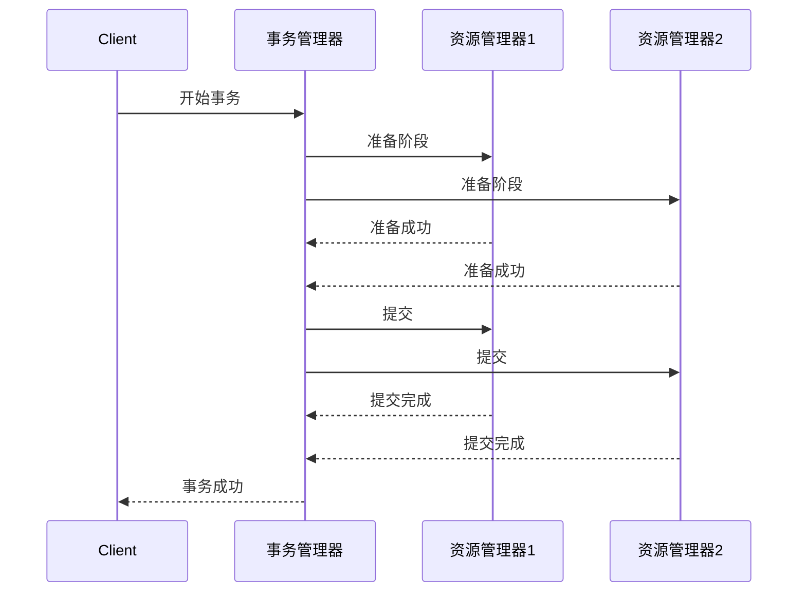
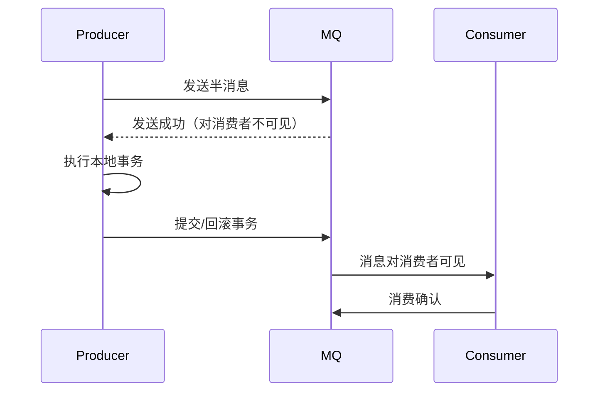
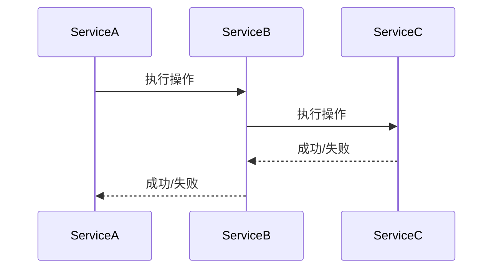
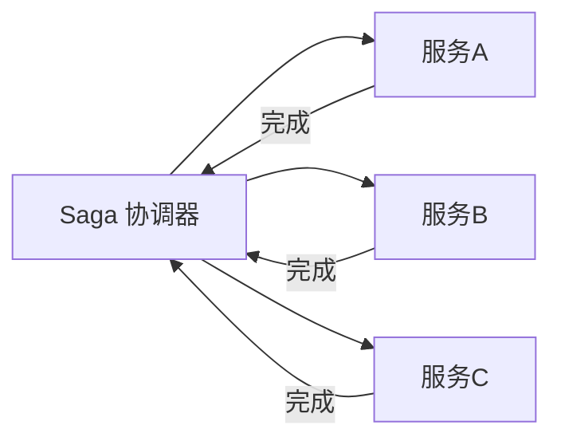
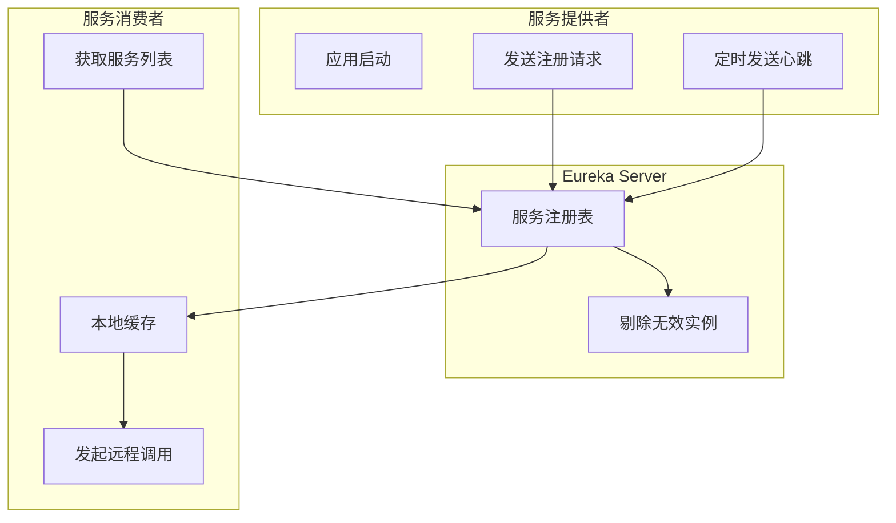
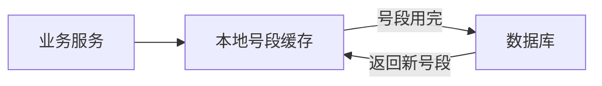

# 分布式服务

## 一、分布式系统基础

### 1.1 什么是分布式系统

分布式系统是由多个独立的计算机节点组成的系统，这些节点通过网络进行通信和协调，共同完成共同的任务。对于用户来说，分布式系统就像一个单一的计算机系统。

**核心特征：**
- **透明性**：用户无需了解系统内部结构
- **开放性**：遵循标准协议，便于扩展
- **可扩展性**：可以方便地增加节点
- **可靠性**：单个节点故障不影响整体

### 1.2 分布式 vs 集群

| 特性 | 集群 | 分布式 |
|------|------|--------|
| 定义 | 多台服务器部署同一服务 | 多台服务器部署不同服务 |
| 目的 | 提高可用性和负载能力 | 业务解耦、提高系统扩展性 |
| 通信 | 服务间可能不通信 | 服务间必须通信 |
| 复杂度 | 较低 | 较高 |

## 二、CAP 理论

### 2.1 CAP 三个要素

CAP 理论指出，分布式系统不可能同时满足以下三个要素：

- **C (Consistency) 一致性**：所有节点在同一时间看到的数据是一致的
- **A (Availability) 可用性**：每个请求都能得到响应（不保证是最新数据）
- **P (Partition Tolerance) 分区容错性**：系统在网络分区的情况下仍能继续运行

### 2.2 CAP 权衡

由于 P 是分布式系统的固有属性（网络分区不可避免），因此实际只能在 CP 和 AP 之间权衡：

#### CP 系统（保证一致性和分区容错）

**特点**：
- 当网络分区发生时，为保证一致性，拒绝部分请求
- 牺牲可用性

**适用场景**：
- 金融系统（银行转账）
- 库存系统
- 配置中心（如 ZooKeeper、etcd）

**典型代表**：
- ZooKeeper
- etcd
- HBase
- Redis Sentinel/Cluster（部分模式）

#### AP 系统（保证可用性和分区容错）

**特点**：
- 网络分区时，系统继续提供服务，但数据可能不一致
- 牺牲一致性，但保证最终一致性

**适用场景**：
- 社交网络
- 电商商品展示
- 内容分发

**典型代表**：
- Cassandra
- DynamoDB
- Eureka
- Consul（AP 模式）

### 2.3 BASE 理论

BASE 理论是对 CAP 理论的延伸，核心思想是**即使无法做到强一致性，每个应用也可以根据自身业务特点，采用适当的方式来使系统达到最终一致性**。

- **BA (Basically Available) 基本可用**：允许系统出现局部不可用
- **S (Soft state) 软状态**：允许系统中的数据存在中间状态
- **E (Eventually consistent) 最终一致性**：经过一定时间后，所有节点数据最终一致

## 三、分布式事务

### 3.1 本地事务 vs 分布式事务

**本地事务**：单个数据库（单机）上的事务，由 ACID 保证

**分布式事务**：涉及多个数据库或服务的事务，需要额外的协调机制

### 3.2 2PC（两阶段提交）

**原理**：



**两阶段**：
1. **准备阶段（Prepare Phase）**：
   - 事务管理器询问所有参与者是否可以提交
   - 参与者执行事务操作，但不提交
   - 参与者返回 Yes 或 No

2. **提交阶段（Commit Phase）**：
   - 如果所有参与者都返回 Yes，发送提交指令
   - 如果有参与者返回 No，发送回滚指令

**缺点**：
- **同步阻塞**：所有参与者阻塞等待
- **单点故障**：事务管理器故障导致阻塞
- **数据不一致**：提交阶段部分节点失败

**改进方案**：3PC（三阶段提交）- 增加预提交阶段，降低阻塞概率，但仍无法完全解决

### 3.3 TCC（Try-Confirm-Cancel）

TCC 是一种应用层的分布式事务解决方案。

**三个阶段**：

| 阶段 | 操作 | 说明 |
|------|------|------|
| Try | 资源预留 | 预留资源，检查资源是否充足 |
| Confirm | 确认执行 | 确认执行业务操作，使用 Try 阶段预留的资源 |
| Cancel | 取消执行 | 释放 Try 阶段预留的资源 |

**示例**：扣减库存

```java
// Try 阶段
public boolean tryReduceStock(Long productId, Integer count) {
    // 检查库存是否足够
    // 预扣库存（冻结库存）
    return inventoryDao.freezeStock(productId, count) > 0;
}

// Confirm 阶段
public boolean confirmReduceStock(Long productId, Integer count) {
    // 真实扣减库存
    return inventoryDao.deductFrozenStock(productId, count);
}

// Cancel 阶段
public boolean cancelReduceStock(Long productId, Integer count) {
    // 释放冻结的库存
    return inventoryDao.releaseFrozenStock(productId, count);
}
```

**优点**：
- 性能较好，没有锁等待
- 最终一致性

**缺点**：
- 代码侵入性强，每个业务需要实现三个接口
- 需要考虑幂等性
- 需要处理空回滚、悬挂等异常情况

### 3.4 本地消息表

**原理**：利用本地事务保证业务操作和消息写入的原子性，然后通过定时任务或消息队列确保消息被消费。


**实现步骤**：
1. 在同一个本地事务中，完成业务操作和消息记录的插入
2. 定时任务扫描未发送的消息，发送到消息队列
3. 消费者消费消息，执行下游业务
4. 消费成功后标记消息为已处理

**优点**：
- 实现简单，不依赖外部组件
- 最终一致性

**缺点**：
- 需要额外的消息表
- 定时任务可能产生延迟

### 3.5 事务消息（基于 RocketMQ）

RocketMQ 提供了事务消息功能，解决了分布式事务问题。

**原理**：



**实现流程**：
1. 发送半消息（Half Message）：消息写入 MQ 但对消费者不可见
2. 执行本地事务
3. 根据本地事务结果提交或回滚消息
4. 如果未收到提交/回滚，MQ 会回调检查事务状态
5. 提交后消息对消费者可见

### 3.6 Saga 模式

Saga 模式将长事务拆分为多个本地事务，每个本地事务都有对应的补偿操作。

**两种实现方式**：

#### 1. 编排式（Choreography）



#### 2. 协调式（Orchestration）



**优点**：
- 避免长时间锁定资源
- 适合长事务场景

**缺点**：
- 需要实现补偿操作
- 状态管理复杂

## 四、服务注册与发现

### 4.1 核心概念

**服务注册**：服务启动时将自己的网络信息（IP、端口）注册到注册中心

**服务发现**：服务消费者从注册中心获取服务提供者的地址列表

### 4.2 主流注册中心对比

| 特性 | Eureka | Consul | Nacos | ZooKeeper |
|------|--------|--------|-------|-----------|
| CAP | AP | CP/AP | CP/AP | CP |
| 一致性协议 | 自研 | Raft | Distro/Raft | ZAB |
| 健康检查 | 客户端心跳 | TCP/HTTP/gRPC | TCP/HTTP | TCP |
| 负载均衡 | 客户端 | 客户端/服务端 | 客户端/服务端 | 客户端 |
| 配置中心 | 不支持 | 支持 | 支持 | 不支持 |
| 状态维护 | 内存 | 内存+磁盘 | 内存+磁盘 | 内存+磁盘 |

### 4.3 Eureka 工作原理



**关键机制**：

1. **服务注册**：服务启动时发送注册请求
2. **服务续约**：每 30 秒发送一次心跳
3. **服务剔除**：90 秒内未收到心跳则剔除
4. **服务下线**：服务关闭时发送下线请求
5. **服务获取**：每 30 秒拉取一次服务列表
6. **自我保护**：如果短时间内丢失大量心跳，进入自我保护模式，不剔除实例

### 4.4 Nacos 工作原理

**两种模式**：

1. **AP 模式**（默认）：
   - Distro 协议（阿里自研）
   - 每个节点存储部分数据，互相同步
   - 保证最终一致性

2. **CP 模式**：
   - Raft 协议
   - 通过 Leader 选举保证强一致性
   - 适用于配置中心场景

**健康检查**：
- 临时实例：客户端主动上报，适合无状态服务
- 持久化实例：服务端主动探测，适合有状态服务

## 五、分布式锁

### 5.1 实现方案对比

| 方案 | 实现方式 | 优点 | 缺点 |
|------|----------|------|------|
| Redis | SETNX + EXPIRE | 性能高 | 主从切换可能丢失锁 |
| ZooKeeper | 临时顺序节点 | 可靠性高 | 性能较低 |
| 数据库 | 唯一索引 | 简单 | 性能差，数据库压力大 |

### 5.2 Redis 分布式锁（Redisson 实现）

```java
// Redisson 分布式锁
RLock lock = redisson.getLock("myLock");
try {
    // 尝试获取锁，最多等待 10 秒，锁自动释放时间 30 秒
    if (lock.tryLock(10, 30, TimeUnit.SECONDS)) {
        // 执行业务逻辑
        doBusiness();
    }
} finally {
    lock.unlock();
}
```

**Redisson 看门狗机制**：
- 获取锁时指定 leaseTime = -1，启用看门狗
- 每隔 10 秒检查并续约锁
- 适用于业务执行时间不确定的场景

### 5.3 ZooKeeper 分布式锁

```java
// 创建临时顺序节点
String lockPath = zk.create("/locks/lock-",
    null,
    ZooDefs.Ids.OPEN_ACL_UNSAFE,
    CreateMode.EPHEMERAL_SEQUENTIAL);

// 获取所有锁节点
List<String> children = zk.getChildren("/locks", false);

// 判断是否是最小的节点
if (isSmallestNode(lockPath, children)) {
    // 获取锁成功
    try {
        doBusiness();
    } finally {
        zk.delete(lockPath, -1);
    }
} else {
    // 监听前一个节点
    String previousNode = getPreviousNode(lockPath, children);
    zk.exists(previousNode, watcher);
}
```

**优点**：
- 临时节点，客户端断开连接自动释放
- 顺序节点，避免羊群效应
- 可靠性高

## 六、分布式 ID

### 6.1 需求

- 全局唯一
- 有序性（可选）
- 高性能
- 可用性

### 6.2 常见方案

| 方案 | 优点 | 缺点 |
|------|------|------|
| UUID | 简单、唯一 | 无序、长度长 |
| 数据库自增 | 简单 | 性能差、扩展困难 |
| Redis INCR | 高性能 | 持久化问题 |
| 雪花算法 | 有序、高性能 | 时钟回拨问题 |
| 号段模式 | 高性能 | ID 不连续 |

### 6.3 雪花算法（Snowflake）

**结构**（64 bit）：

```
0 | 0000000000 0000000000 0000000000 0000000000 0 | 00000 | 00000 | 000000000000
  |----------------41位时间戳-------------------|--5位数据中心--|--5位机器ID--|--12位序列号--
```

- 1 bit：符号位（始终为 0）
- 41 bit：毫秒级时间戳（可用约 69 年）
- 10 bit：机器 ID（5 bit 数据中心 + 5 bit 机器）
- 12 bit：序列号（每毫秒可生成 4096 个 ID）

**时钟回拨处理**：
1. 等待时钟追上
2. 抛出异常
3. 使用备用机器 ID

### 6.4 号段模式（Leaf-segment）

**原理**：预先从数据库获取一段 ID 号段，缓存在本地，用完后再获取。



**优点**：
- 性能高，减少数据库压力
- 实现简单

**缺点**：
- ID 不连续（服务重启）
- 号段用完后需要等待数据库响应

**改进**：双 Buffer 优化，提前预加载下一个号段。
